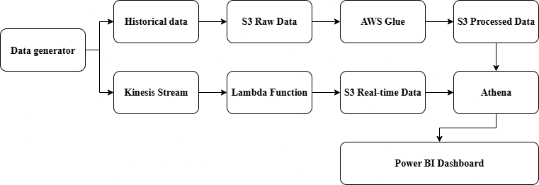
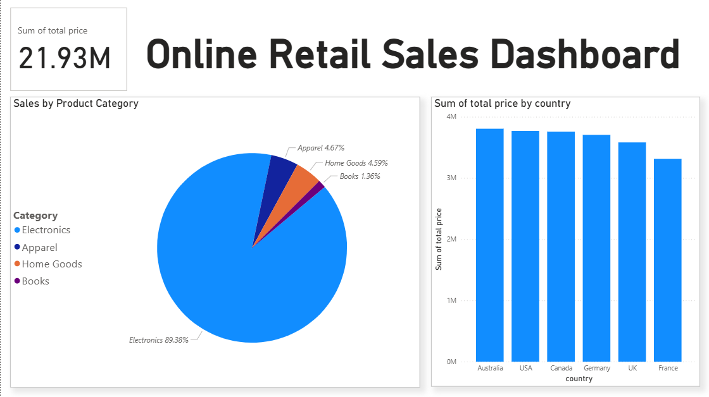

# End-to-End Cloud Data Pipeline for Online Retail Analytics

## Project Overview
This project demonstrates a scalable, cloud-native data pipeline built on Amazon Web Services (AWS). It is designed to process both large historical datasets (batch processing) and live event data (real-time streaming) for a fictional e-commerce company. The processed data is then made available for analysis and visualization through an interactive Power BI dashboard.

## Architecture Diagram
*(You can create a simple diagram using a tool like diagrams.net and upload it to your screenshots folder, then link it here!)*

## Tech Stack
- **Cloud Provider:** AWS
- **Data Lake:** Amazon S3
- **Batch Processing (ETL):** AWS Glue, PySpark
- **Real-Time Streaming:** Amazon Kinesis Data Streams
- **Stream Processing:** AWS Lambda (Python)
- **Data Querying:** Amazon Athena (SQL)
- **Infrastructure as Code (IaC):** AWS CloudFormation/Terraform *(Optional: a great next step!)*
- **BI & Visualization:** Microsoft Power BI

## Project Features
- **Batch Pipeline:** A PySpark script running on AWS Glue reads large CSV files from an S3 bucket, performs data cleaning and transformation, and writes the data back to S3 in the efficient Parquet format.
- **Real-Time Pipeline:** A Python script generates live sales data and sends it to an AWS Kinesis stream. An AWS Lambda function is triggered by these events, processing them on the fly and storing them as JSON files in S3.
- **Data Lakehouse:** Amazon S3 serves as a central, scalable data lake. Amazon Athena is used to query both the batch (Parquet) and real-time (JSON) data using standard SQL, creating a simple Lakehouse architecture.
- **Interactive Dashboard:** A Power BI dashboard connects directly to Athena, providing key business insights like total sales, sales by country, and top product categories.

## Dashboard Screenshot
Here is a preview of the final Power BI dashboard.

## How to Run
1. **Setup AWS Infrastructure:** Configure S3 buckets, Kinesis stream, Glue job, and Lambda function.
2. **Batch Data:** Upload the historical CSV data to the 'raw-data' S3 bucket and run the Glue ETL job.
3. **Real-Time Data:** Run the `data_generator.py` script with the appropriate Kinesis stream name and AWS region to start streaming live data.
4. **Query Data:** Use the provided SQL queries in Amazon Athena to create tables on top of the processed data in S3.
5. **Visualize:** Connect Power BI to Amazon Athena using the ODBC driver and open the `.pbix` file.

## The Most Important Rule: Security
**NEVER EVER upload your secret AWS keys (Access Key ID and Secret Access Key) to GitHub.** The `.gitignore` file in this repository is set up to ignore common Python files, but always double-check that you are not committing any file that contains your credentials.
